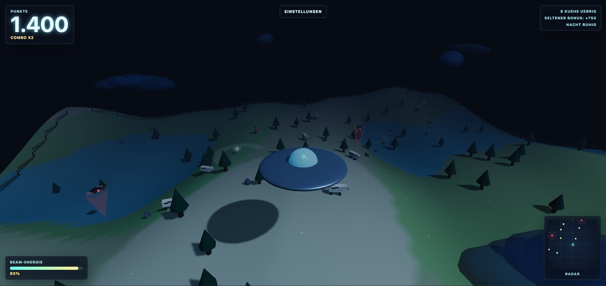

# UFO Cow Hunt

A small 3D browser game built with Three.js: fly a UFO across a moonlit farm landscape, find cows, and abduct them with your light beam. Between radar sweeps, farm drones, synth music, and sci-fi sound effects, the goal is to collect every target as smoothly as possible.


## Play

[Play UFO Cow Hunt on GitHub Pages](https://ddave82.github.io/Ufo-Cow-Hunt/)



## Gameplay

You control a UFO across a nighttime farm world. Cows give points, a rare drunk bonus human gives extra points, and energy crystals recharge your beam. Farm drones are not instant-death enemies, but they trigger alarms and drain beam energy.

Once everything has been collected, the round ends: the UFO blasts into the sky, the takeoff sound plays, and your final time and score are shown.

## Features

- Low-poly 3D landscape with terrain, water, trees, rocks, clouds, stars, and moonlight
- Detailed UFO with metal rivets, glass dome, and a tiny alien inside
- Light beam for abducting cows and bonus targets
- Rotating radar with targets, drones, and world boundary
- Score system with combo multiplier
- Beam energy, boost, and rechargeable energy crystals
- Farm drones with alarm and energy-drain behavior
- Start menu, settings menu, and end screen with restart
- Separate volume controls for UFO/effects and music
- Music playlist using `music_1.mp3` and `music_2.mp3`
- Ambient sound, beam sound, takeoff sound, and gameplay feedback sounds

## Controls

| Key | Action |
| --- | --- |
| `W` or `Arrow Up` | Thrust forward |
| `A` / `D` or `Arrow Left` / `Arrow Right` | Turn the UFO |
| `S` or `Arrow Down` | Brake |
| `Space` | Activate the light beam |
| `Shift` | Boost |
| `Esc` | Open/close settings |
| `M` | Mute sound |

## Local Setup

Requirements:

- Node.js
- npm

Install dependencies:

```bash
npm install
```

Start the dev server:

```bash
npm run dev
```

Then open the game in your browser:

```text
http://127.0.0.1:5173/
```

## Build

```bash
npm run build
```

Preview the production build:

```bash
npm run preview
```

## Sound Files

Music and effects are stored locally in the `sounds/` folder and bundled as assets by Vite during the build.

- `music_1.mp3` and `music_2.mp3`: looping music playlist
- `atmo.mp3`: ambient atmosphere, played at regular intervals
- `beam.mp3`: beam sound while abducting targets
- `takeoff.mp3`: sound for successful level completion
- `countdown.mp3`: reserved for a future round timer/countdown mechanic

## Tech Stack

- [Three.js](https://threejs.org/) for 3D rendering
- [Vite](https://vite.dev/) for the dev server and build pipeline
- Web Audio API and HTML Audio for synth sounds and MP3 playback

## Status

Playable prototype. The next larger idea is a round timer with a countdown once the right balance between relaxed exploration and extra action has been found.
