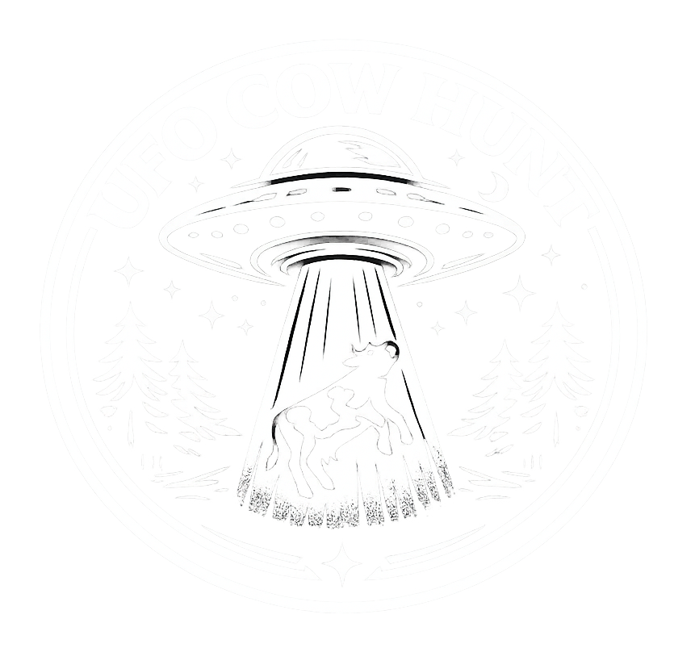
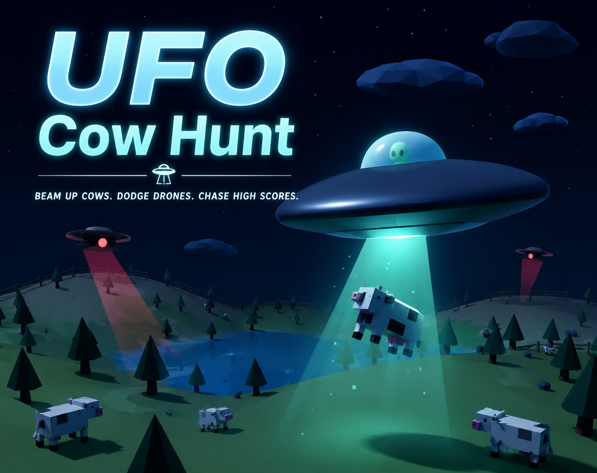

# UFO Cow Hunt



A small 3D browser game built with Three.js: fly a UFO across stylized low-poly night landscapes, find animals, and abduct them with your light beam. Between radar sweeps, search drones, synth music, desert ruins, frozen ridges, farm fields, and sci-fi sound effects, the goal is to clear three arcade hunting waves as smoothly as possible.


## Play

[Play UFO Cow Hunt on GitHub Pages](https://ddave82.github.io/Ufo-Cow-Hunt/)



## Gameplay

You control a UFO across selectable mission zones. The current levels are Farm Night with cows, Desert Hunt with camels, and Ice Drift with polar bears. Animals give points, a rare bonus human, traveler, or explorer gives extra points, and energy crystals recharge your beam. Search drones are not instant-death enemies, but they trigger loud alarms, flash the HUD, slow the UFO, and drain beam energy when they lock onto you.

Each mission is split into three waves in the same selected level:

- Wave 1: abduct 10 animals in 1:35
- Wave 2: abduct 15 animals in 1:55
- Wave 3: abduct 20 animals in 2:15

Energy crystals are optional support items. They do not need to be collected to finish a wave or complete the mission, but they help keep the beam ready. When a wave timer runs out, the next wave starts and only the points collected in time count. After Wave 3 is cleared in time, the UFO blasts into the sky and the takeoff sound plays; if Wave 3 times out, the final score is locked with the points collected so far.

## Features

- Low-poly 3D landscapes with terrain, clouds, stars, moonlight, and level-specific props
- Level selection with Farm Night, Desert Hunt, and Ice Drift
- Farm Night with fields, ponds, trees, fences, hay bales, cows, and a rare bonus human
- Desert Hunt with warmer yellow sand, dunes, sandstone boundary blocks, palm oases, rocks, cacti, Bedouin tent camps, camels, a desert traveler, and a collidable pyramid
- Ice Drift with snowy terrain, frozen lakes, icebergs, snow pines, polar bears, glowing crystals, and a polar explorer bonus human
- Detailed UFO with metal rivets, glass dome, and a tiny alien inside
- Light beam for abducting level animals and bonus targets
- Three-wave progression with wave timers, wave summaries, score bonuses, and time-up scoring
- Wave-specific animal behavior: boost scares animals from Wave 2 onward, and targets wander slowly in Wave 3
- Rotating radar with targets, drones, and world boundary
- Score system with combo multiplier and final score breakdown
- Beam energy, boost, and rechargeable energy crystals
- Search drones with louder contact alarms, visible red HUD feedback, scan beams, UFO slowdown, and energy-drain behavior
- Level selection, instruction screen, settings menu, and larger mission-complete reward screen
- Separate volume controls for UFO/effects and music
- Music playlist using `music_1.mp3` and `music_2.mp3`
- Ambient sound, beam sound, takeoff sound, and gameplay feedback sounds
- Countdown sound near the end of each wave

## Controls

| Key | Action |
| --- | --- |
| `W` or `Arrow Up` | Thrust forward |
| `A` / `D` or `Arrow Left` / `Arrow Right` | Turn the UFO |
| `S` or `Arrow Down` | Brake |
| `Space` | Activate the light beam |
| `Shift` | Boost |
| `Esc` | Open/close settings |
| `M` | Mute sound |

## Local Setup

Requirements:

- Node.js
- npm

Install dependencies:

```bash
npm install
```

Start the dev server:

```bash
npm run dev
```

Then open the game in your browser:

```text
http://127.0.0.1:5173/
```

## Build

```bash
npm run build
```

Build specifically for GitHub Pages:

```bash
npm run build:pages
```

Preview the production build:

```bash
npm run preview
```

## Sound Files

Music and effects are stored locally in the `sounds/` folder and bundled as assets by Vite during the build.

- `music_1.mp3` and `music_2.mp3`: looping music playlist
- `atmo.mp3`: ambient atmosphere, played at regular intervals
- `beam.mp3`: beam sound while abducting targets
- `takeoff.mp3`: sound for successful level completion
- `countdown.mp3`: warning sound near the end of each wave timer

## Tech Stack

- [Three.js](https://threejs.org/) for 3D rendering
- [Vite](https://vite.dev/) for the dev server and build pipeline
- Web Audio API and HTML Audio for synth sounds and MP3 playback

## Status

Playable prototype with two mission zones, timed waves, scoring, drone pressure, and local audio assets.
