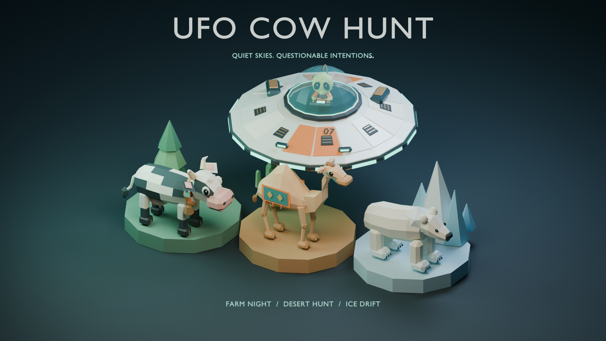
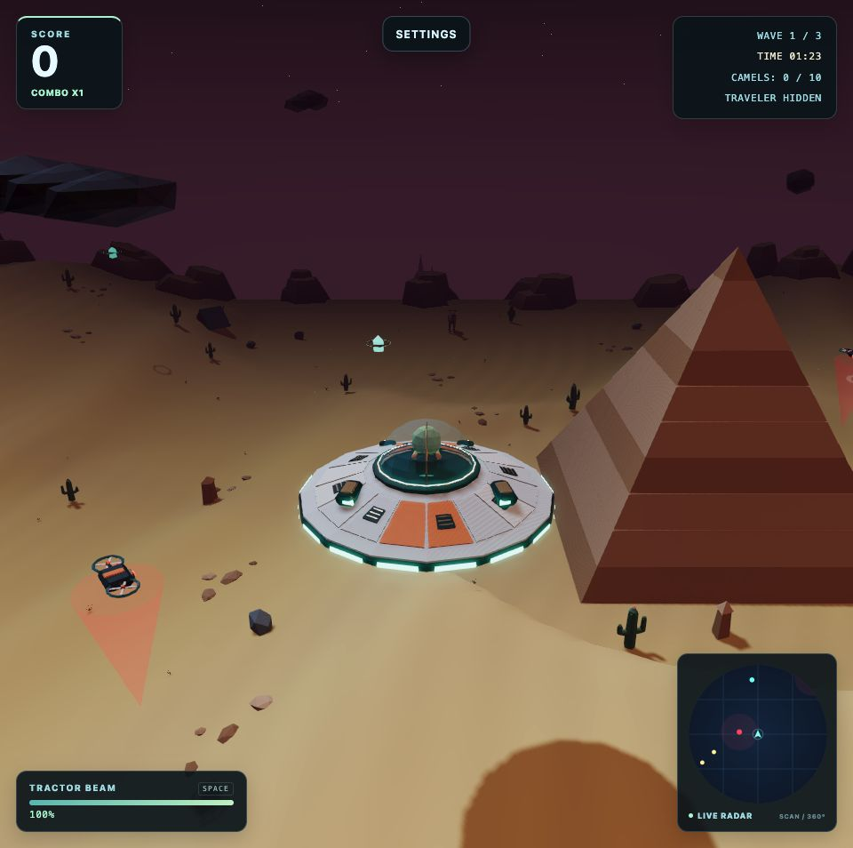
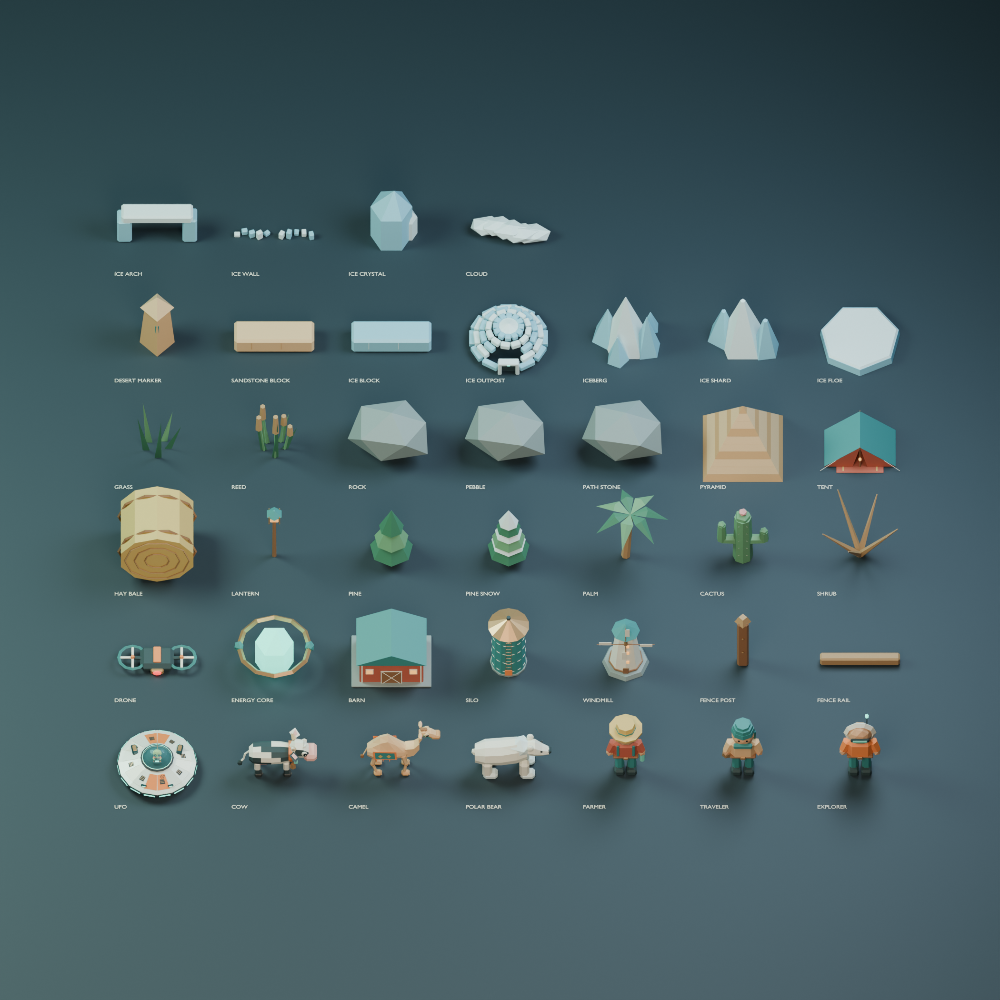
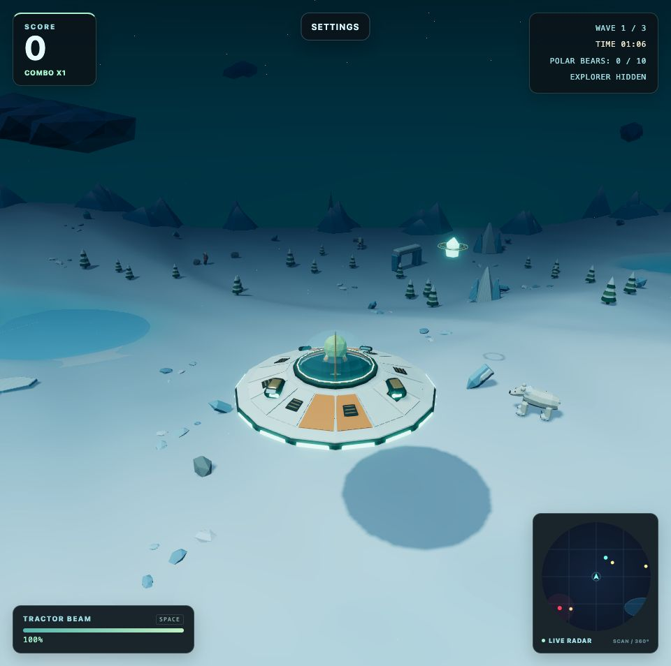

# UFO Cow Hunt

**Quiet skies. Questionable intentions.**

Pilot a UFO through three low-poly night worlds, beam up animals, collect energy and
stay ahead of patrol drones. A small desktop browser arcade game built with Three.js,
Vite and a custom Blender model library.



[Play on itch.io](https://eldooderino.itch.io/ufo-cow-hunt) ·
[Play on GitHub Pages](https://ddave82.github.io/Ufo-Cow-Hunt/) ·
[Visual update devlog](https://eldooderino.itch.io/ufo-cow-hunt/devlog/1686095/a-new-look-for-ufo-cow-hunt-39-models-three-refreshed-worlds) ·
[itch.io upload guide & media](docs/itch-io/README.md) ·
[Changelog](CHANGELOG.md)

> The October visual update is live on itch.io. GitHub Pages deploys automatically
> from `main`; itch.io uploads are packaged separately from the current checkout.
> Desktop keyboard controls; touch controls are not implemented.

## Three worlds to explore

| Mission | Targets | Scenery |
| --- | --- | --- |
| **Farm Night** | Cows + a hidden farmer | Meadows, ponds, fences, barn, silo, windmill and wildflowers |
| **Desert Hunt** | Camels + a hidden traveler | Sculpted dunes, sandstone formations, palm oases, tents and a pyramid |
| **Ice Drift** | Polar bears + a hidden explorer | Snowdrifts, frozen lakes, ice peaks, crystals and an ice outpost |



## How to play

Each mission has three timed waves: **10 animals in 1:35**, **15 in 1:55**, then
**20 in 2:15**. Fly above a target and hold the tractor beam to collect it. Build
combos, find the bonus character and touch floating energy cores to recharge.
Cores are optional and do not require the beam.

Drones slow the UFO and drain energy on contact. Choose Easy (no drones), Normal
(three) or Hard (four). From wave two, boost can scare animals; in wave three,
targets wander. Every wave receives fresh, separated spawn positions on clear ground;
animals avoid water, buildings, trees, fences and each other while moving. Wave timeouts advance the mission; clear the last wave in time for
the takeoff finish. The results screen breaks down animals, pickups and bonuses.

| Key | Action |
| --- | --- |
| **W / ↑** | Thrust forward |
| **A / D / ← / →** | Turn |
| **S / ↓** | Brake |
| **Space** | Tractor beam |
| **Shift** | Boost |
| **Esc** | Settings / pause |
| **M** | Mute |

Contextual hints explain the controls. Settings include drone difficulty, music and
effects volume. Music, ambience and beam/takeoff/countdown sounds are bundled locally.

## The October visual update

The UFO, animals, characters, buildings and scenery now share **39 custom low-poly
Blender models**. The Scout-07 saucer has a ceramic hull, copper trim, glowing engines
and a visible pilot. Cow, camel and polar bear silhouettes stay readable in flight.



The landscapes have also changed: block rows around the desert and ice maps became
natural formations; dunes and snowdrifts have more shape. Ground colors blend
smoothly, fine wind patterns fade in the distance, and final-image anti-aliasing
reduces jagged edges. Small stone groups, wildflowers, dust, snow and light motes add
life. Ambient particle motion respects the reduced-motion preference.

A follow-up polish pass adds connected timber fences, pasture entrances and a mixed
woodland boundary to Farm Night. Transparent glow effects no longer contribute solid
contact shadows, and the moving UFO no longer receives stale self-shadows.

Repeated props use instancing, static scenery is batched, and cached model resources
survive mission changes. The model library has **21,558 unique triangles** and a
**1.97 MB GLB**. Desert and ice ground meshes each use **25,088 triangles**. These
are geometry budgets, not FPS guarantees; actual performance depends on the device,
viewport and render mode.



## Run and build

Use Node.js **20.19+ or 22.12+** (Vite 8), npm, and a modern WebGL2 browser.

```sh
npm ci
npm run dev                 # http://127.0.0.1:5173/
npm run build               # dist/, with relative asset paths
npm run preview             # production preview, usually port 4173
```

For GitHub Pages use `npm run build:pages`, which sets `/Ufo-Cow-Hunt/` as the base.
For itch.io use the relative-path build:

```sh
npm run package:itch        # also requires Python 3 (standard library only)
```

This creates:

- `releases/ufo-cow-hunt-itch.zip` — upload this as the HTML game; `index.html` is at the root.
- `releases/ufo-cow-hunt-press-kit.zip` — devlogs, page copy, screenshots, cover and banner.
- `releases/release-manifest.json` — source commit, archive sizes and SHA-256 checksums.

Generated archives and `dist/` are ignored by Git. See the
[upload guide](docs/itch-io/README.md) for settings and media captions.

## Blender sources

| File | Purpose |
| --- | --- |
| [library.blend](assets/models/library/library.blend) | Editable catalogue, one collection per asset |
| [models.glb](assets/models/library/models.glb) | Native-scale game export |
| [manifest.json](assets/models/library/manifest.json) | Per-model triangle and mesh counts |
| [press-kit.blend](assets/models/library/press-kit.blend) | Staged promotional scene using game models |
| [scout-07.blend](assets/models/ufo/scout-07.blend) | Reviewed UFO source |
| [meadow-01.blend](assets/models/cow/meadow-01.blend) | Reviewed cow source |
| [dune-01.blend](assets/models/camel/dune-01.blend) | Standalone camel source |

Created with Blender 4.5 LTS. Regenerate from the repository root:

```sh
blender --background --factory-startup --python scripts/blender/build_library.py
blender --background --factory-startup --python scripts/blender/prepare_viewer.py
blender --background --factory-startup --python scripts/blender/render_press_kit.py
```

The catalogue uses normalized display scales. Use `build_library.py` for native-scale
exports; do not export the arranged catalogue as the game map. Terrain, water and sky
are generated by the runtime. The promotional scene is staged key art, not an exact
level export. Blender scripts do not need to run to play or build the browser game.

## Validation and diagnostics

```sh
npm run check:models
npm run check:spawns
npm run build
npm run build:pages
```

On the development server, open `/?modelTest=1` for integration checks, or
`/?modelTest=1&forceItchCompat=1` for the compatibility rendering path. They exercise
all three waves of all missions, beam collection, bonus targets, pickups, drone drain,
rotors, mission completion and takeoff. They also check terrain vertices, continuous
ice shores, particle budgets, final anti-aliasing and repeated mission changes.
Each world additionally checks 60 wave layouts and 60 simulated seconds of wandering
and boost scares: fresh positions, minimum spacing, dry ground and solid prop clearance.

The checks reposition targets and advance simulation directly; they are not a full
real-time playthrough or a test of itch.io hosting. The runner is removed from
production builds. `?perfDebug=1` shows render counters and frame-time percentiles.
Use development `?flightTest=1` (optionally with `&forceItchCompat=1`) for a fixed
flight comparison; see the [shadow/performance report](docs/PERFORMANCE-2026-10-02.md).

Implementation notes and the earlier rollback checkpoint are in
[the historical September report](docs/GRAFIK-UPDATE.md). Current gameplay code lives
in `src/main.js`, model loading/batching in `src/models/`, and ground materials and
ambient scenery in `src/landscape/`.
