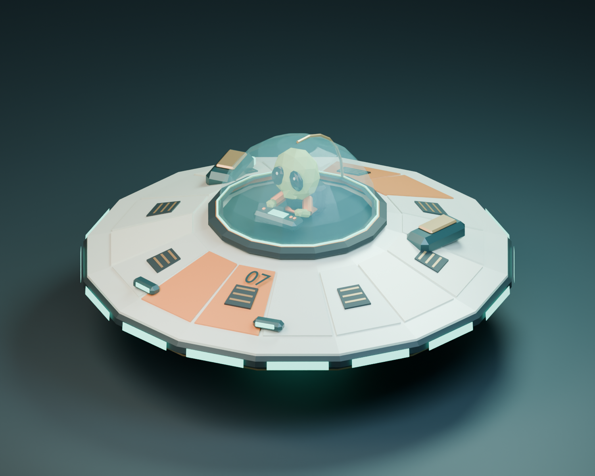
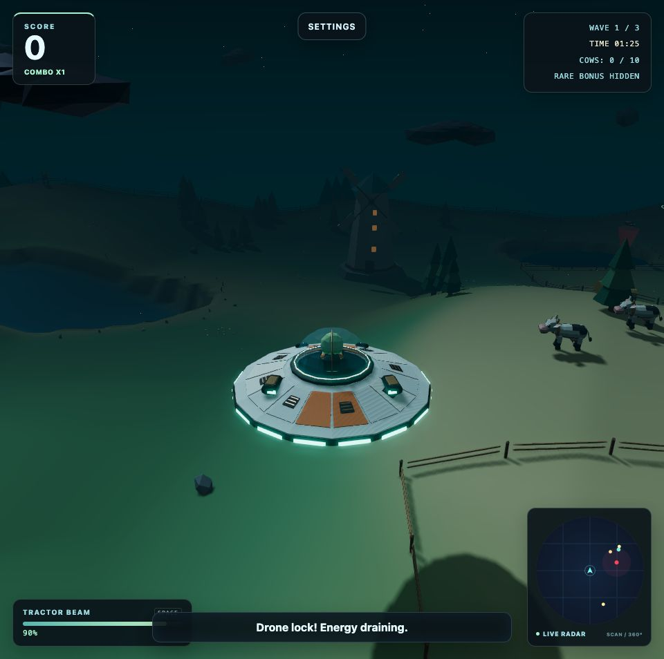

# Neuer Look für UFO Cow Hunt: 39 Modelle und drei überarbeitete Welten

UFO Cow Hunt hat ein großes Grafikupdate bekommen. Vom kleinen Alien im Cockpit bis
zu den Landschaften unter dem UFO passt jetzt alles besser zusammen. Ziel war ein
klarer Low-Poly-Stil, in dem die Spielobjekte auch während des Fliegens gut erkennbar
bleiben.

## Eine gemeinsame Modellbibliothek

Das Spiel verwendet jetzt **39 in Blender erstellte Modelle**: UFO, Kühe, Kamele,
Eisbären, drei Bonusfiguren, Drohnen, Energieobjekte, Gebäude, Pflanzen und Dekoration.
Das Scout-07-UFO kombiniert einen hellen Keramikrumpf mit Kupferdetails, einem
leuchtenden Triebwerksring und einer Glaskabine mit sichtbarem Piloten.

*Ein Blick hinter die Kulissen: Die Modelle sind für diese Studioübersicht auf
unterschiedliche Anzeigegrößen skaliert. Das Bild zeigt den Blender-Katalog,
keinen Spielausschnitt.*

## Drei Landschaften mit mehr Charakter

**Farm Night** behält seine grünen Hügel, Teiche und nächtlichen Farmgebäude.
Kleine Wildblumeninseln und schwebende Lichtpunkte bringen mehr Leben auf die Wiesen.

**Desert Hunt** bekommt ausgeprägtere Dünen und unregelmäßige Sandsteinformationen.
Die wiederholten Blockreihen am Rand sind verschwunden. Feine Windstrukturen,
kleine Steingruppen und treibender Staub ergänzen die Sandflächen.

**Ice Drift** zeigt Schneeverwehungen, schneebedeckte Eisspitzen und weichere
Übergänge an den gefrorenen Seen. Dezente Schneebewegung und kleine, teilweise
versunkene Steine runden die Landschaft ab.

## Ruhigere Böden statt pixeliger Flächen

Auch der Boden selbst wurde überarbeitet. Harte Farbwechsel und deutlich sichtbare
Dreieckskanten machten einige Flächen unruhig. Farben und Beleuchtung gehen jetzt
weicher ineinander über. Feine Sand- und Schneestrukturen blenden in der Entfernung
aus, damit sie nicht flimmern. Kantenglättung auf dem fertigen Bild und eine bessere
Filterung der Kontaktschatten sorgen für eine ruhigere Darstellung.

## Mehr Details mit klaren Budgets

Die komplette Modellbibliothek umfasst **21.480 einzigartige Dreiecke** und steckt
in einer **1,96 MB großen GLB-Datei**. Wiederholte Objekte teilen sich Geometrie,
statische Dekoration wird zusammengefasst, und die Umgebungspartikel benötigen pro
Welt nur einen Zeichenaufruf. Die Bodenflächen von Wüste und Eiswelt bleiben trotz
der neuen Formen bei jeweils 25.088 Dreiecken.

Das ist keine FPS-Garantie für jedes Gerät. Es hilft dabei, die Grafik gezielt zu
verbessern und die Renderkosten im Blick zu behalten. Automatisierte Tests prüfen
alle drei Missionen in beiden Render-Modi, einschließlich wiederholter Levelwechsel.

## Der Auftrag bleibt derselbe

Drei Wellen, 10, 15 und 20 Tiere: fliegen, Ziele einsammeln, Energie nachladen,
Bonusfiguren entdecken und den Patrouillendrohnen ausweichen. Diese Regeln bleiben
beim Grafikupdate erhalten.

**Welche Welt gefällt euch am besten: Farm, Wüste oder Eis?** Rückmeldungen zur
Lesbarkeit und Performance helfen besonders. Wenn etwas ruckelt oder falsch
aussieht, nennt bitte euren Browser und euer Gerät.
